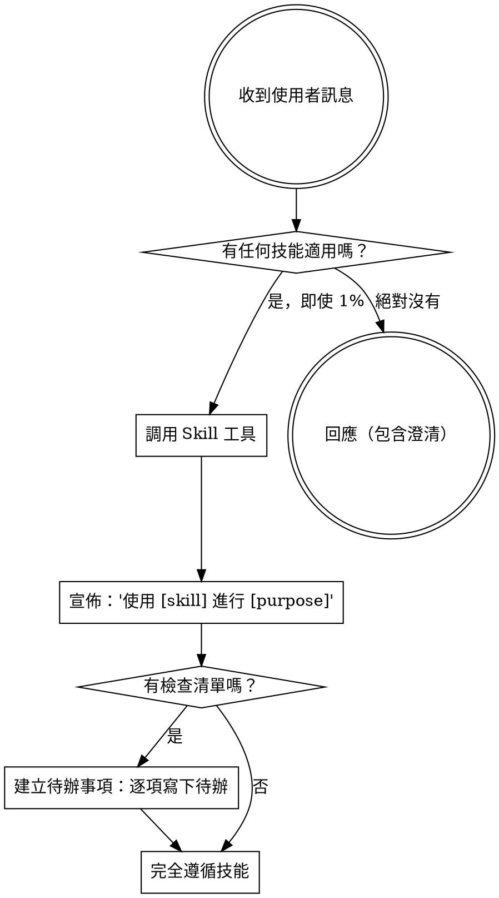

<EXTREMELY-IMPORTANT>
如果你認為有 1% 的機會某項技能可能適用於你正在做的事情，你「絕對必須」調用該技能。

如果有一項技能適用於你的任務，你別無選擇。你必須使用它。

這是不可協商的。這不是可選的。你無法找藉口逃避這一點。
</EXTREMELY-IMPORTANT>

## 如何存取技能

**在 Antigravity 中：** 使用 `Skill` 工具。當你調用一項技能時，其內容會載入並呈現給你——請直接遵循它。絕對不要對技能檔案使用 Read 工具。

**在其他環境中：** 查看你的平台文件以了解如何載入技能。

# 使用技能

## 規則

**在任何回應或行動之前，先調用相關或被要求的技能。** 即使只有 1% 的機會某項技能可能適用，也意味著你應該調用該技能來確認。如果調用後的技能在這個情況下不適用，你就不需要使用它。

## 紅色警訊

這些想法意味著「停止」——你在找藉口：

| 想法 (Thought)            | 現實 (Reality)                             |
| ------------------------- | ------------------------------------------ |
| "這只是一個簡單的問題"    | 問題就是任務。檢查是否有技能。             |
| "我先需要更多上下文"      | 技能檢查要在澄清問題「之前」。             |
| "讓我先探索程式碼庫"      | 技能會告訴你「如何」探索。先檢查。         |
| "我可以快速檢查 git/檔案" | 檔案缺乏對話上下文。檢查是否有技能。       |
| "讓我先收集資訊"          | 技能會告訴你「如何」收集資訊。             |
| "這不需要正式的技能"      | 如果有技能存在，就使用它。                 |
| "我記得這項技能"          | 技能會演進。閱讀當前版本。                 |
| "這不算是一項任務"        | 行動 = 任務。檢查是否有技能。              |
| "這項技能殺雞焉用牛刀"    | 簡單的事情會變複雜。使用它。               |
| "我先做這一件事就好"      | 在做「任何」事情之前先檢查。               |
| "這感覺很有效率"          | 缺乏紀律的行動浪費時間。技能防止這種情況。 |
| "我知道那是什​​麼意思"    | 知道概念 ≠ 使用技能。調用它。              |

## 技能優先順序

當多項技能可能適用時，使用此順序：

1. **流程技能優先** (例如 brainstorming, debugging) - 這些決定「如何」處理任務
2. **實作技能次之** (例如 frontend-design, mcp-builder) - 這些指導執行

"我們來建立 X" → 先 brainstorming，然後實作技能。
"修復這個 bug" → 先 debugging，然後領域特定技能。

## 技能類型

**剛性 (Rigid)** (如 TDD, debugging): 完全遵循。不要因為紀律而調整。

**彈性 (Flexible)** (如 patterns): 根據上下文調整原則。

技能本身會告訴你它是哪一種。

## 使用者指示

指示說的是「什麼 (WHAT)」，而不是「如何 (HOW)」。"新增 X" 或 "修復 Y" 並不意味著跳過工作流程。
